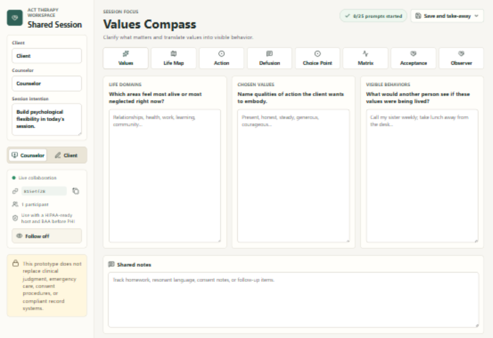

# ACT Therapy Workspace

An interactive Acceptance and Commitment Therapy workspace for shared
client/counselor sessions. The app includes common ACT worksheets and activities
with live room-based editing over WebSockets.

## Demo

[Open the public Render demo](https://act-therapy-workspace-demo.onrender.com).



## Disclosure

This application was coded with assistance from OpenAI Codex. It is provided as
a public demo and prototype only. No guarantee is made that the code is safe,
secure, correct, complete, clinically appropriate, or suitable for production
use. Review, test, and harden the application before relying on it for any real
workflow, especially one involving sensitive, clinical, or protected information.

## License

This project is licensed under the MIT License. See [LICENSE](LICENSE).

## Included Activities

- Values Compass
- Life Map
- Committed Action Plan
- Defusion Lab
- Choice Point
- ACT Matrix
- Acceptance and Expansion
- Observer Self

## Development

Run commands from WSL in this project directory.

```bash
npm install
npm run dev
```

The Vite dev server serves the frontend and proxies `/collaboration` WebSockets
to the Node server on port `4173`. For end-to-end collaboration, run the app
server in another terminal:

```bash
npm start
```

Then open `http://localhost:4173`. Each generated `?room=` URL is a shared
session room.

## Collaboration

Worksheet content syncs live for everyone in the same room. `Follow` mode is
off by default and only one participant can follow at a time. When a participant
turns it on, their view follows another participant's focus changes, worksheet
field focus, and scroll position; the followed field is highlighted in the
follower's view.

## Deployment

The production server in `server.mjs` serves the built React app from `dist` and
hosts the `/collaboration` WebSocket endpoint on the same origin.

Typical deployment command:

```bash
npm ci
npm run build
PORT=4173 npm start
```

For telehealth or in-office use with protected health information, deploy only
on infrastructure covered by the required privacy, security, consent, and BAA
requirements.

### Session Storage Controls

Room content is encrypted in the browser before it is sent over the WebSocket.
The server persists only encrypted state blobs and non-sensitive room metadata:
room id, verifier salt/hash, encryption salt, schema version, and update time.
The server does not receive the room passphrase or the derived
content-encryption key, and it rejects plaintext sync payloads.

Local file-backed storage under `data/sessions` is demo/development storage. It
is disabled automatically when `NODE_ENV=production` unless
`ACT_ENABLE_DEMO_FILE_STORAGE=true` is set. Do not use this demo file store as a
HIPAA production storage control. Production deployments that handle PHI still
need BAA-covered infrastructure for storage, backups, logs, replicas, transport,
monitoring, and operational access.

Retention is controlled with `ACT_SESSION_RETENTION_DAYS` and defaults to 30
days. Expired rooms are removed on startup/load. Users can also delete an
unlocked room from the save panel; deletion removes the encrypted room blob and
associated room metadata from the configured storage.

### Browser Local Data

The app does not automatically persist full session content to `localStorage`.
Browser restore points are created only when a user chooses `Save` in the save
panel for an unlocked room. Those restore points are plaintext in the current
browser profile so they can be restored later, and they may remain on shared
machines, synced browser profiles, local backups, or any environment where
scripts on this origin can read `localStorage`.

Use `Clear local` in the save panel to remove the current room's browser restore
point. Restoring a browser save is available only after the room is unlocked
with the room passphrase, so local data cannot be synced into a room without
authorization.

## Client Take-Away

Use the save panel in the app to:

- explicitly save a browser restore point for the current room
- restore the current browser's saved room state
- clear the current room's browser restore point
- export a Markdown session summary for the client
- export a worksheet-specific SVG visual reference for the active focus
- export a JSON session file that can be imported later
- print or save the current worksheet view as a PDF

## Visual Worksheet Exports

The `Visual` button exports an SVG handout for the currently selected focus.

| Focus | Visual worksheet export |
| --- | --- |
| Values | Life Domains / Values Compass |
| Life Map | Life Map with Me/Noticing axes |
| Action | Committed Action Path |
| Defusion | Hexaflex with Cognitive Defusion highlighted |
| Choice Point | Choice Point fork map |
| Matrix | ACT Matrix |
| Acceptance | Hexaflex with Acceptance highlighted |
| Observer | Hexaflex with Self-as-Context highlighted |
